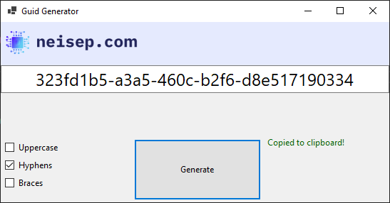

# 🔑 GuidGenerator

A tiny Windows utility to generate a new GUID and automatically copy it to your clipboard. 
Perfect for developers who need quick GUIDs without opening Visual Studio or writing extra code.

---

## ✨ Features
- **One-click:** Generate a GUID with a single button.
- **Clipboard-ready:** Automatically copies the GUID to your clipboard.
- **Lightweight:** Minimal UI, fast startup.
- **Built with:** C# / .NET.

---

## 📦 Installation
- **Clone the repo:**
  git clone https://github.com/neisep/GuidGenerator.git

- **Build:** Open the solution in Visual Studio and build the project.

---

## 🛠 Usage
1. **Launch** GuidGenerator.
2. **Click Generate.**
3. **Paste** the GUID wherever you need—it’s already in your clipboard.

---

## 📸 Screenshot

---

## 🤝 Contributing
- **Fork** the repo.
- **Create** a branch for your changes.
- **Submit** a pull request.

---

## 📄 License
Licensed under **GPL-3.0**. See the LICENSE file for details.

---

## 📬 Contact
Created by [neisep](https://github.com/neisep). Open an issue for suggestions or improvements.
